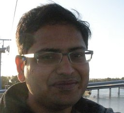
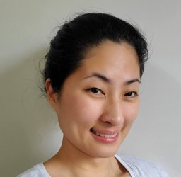
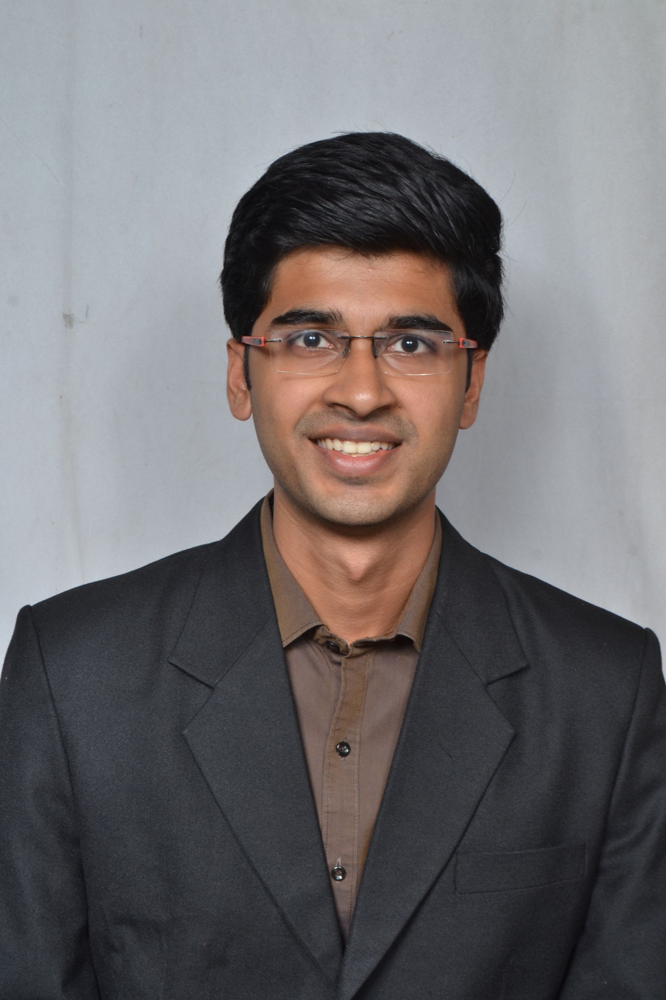
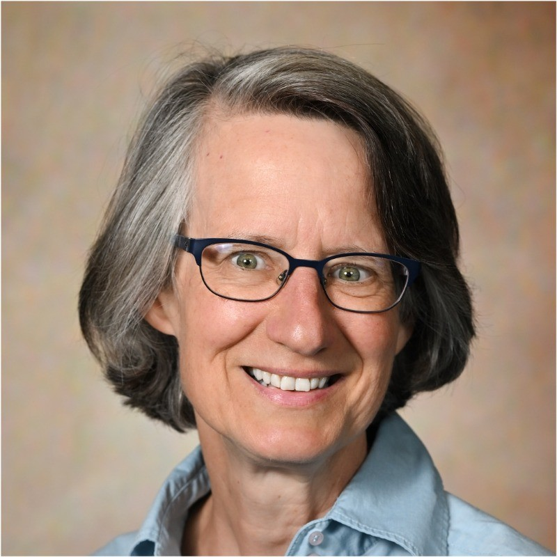
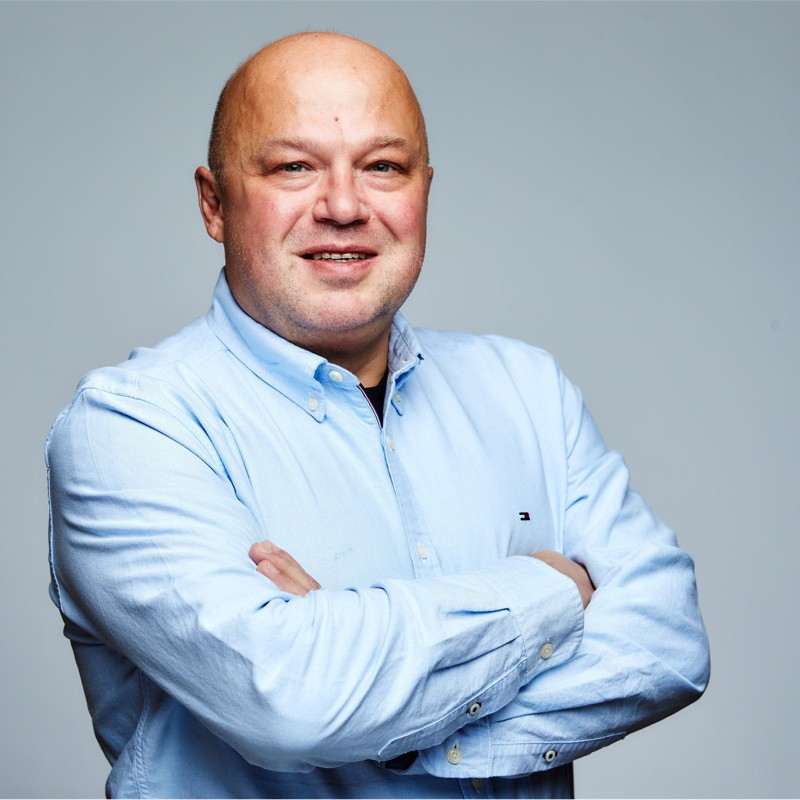

## Overview

The advent of multimodal LLMs like GPT-4o and Gemini has significantly boosted the potential for multimodal search and recommendations. Traditional search engines rely mainly on textual queries, supplemented by session and geographical data. In contrast, multimodal systems create a shared embedding space for text, images, audio, and more, enabling next-gen customer experiences. These advancements lead to more accurate and personalized recommendations, enhancing user satisfaction and engagement.

MMSR will be a **full-day** workshop at [CIKM 2024](https://cikm2024.org/) exploring the latest advancements, challenges, and applications of multimodal search and recommendations.

## Workshop Program Format

The workshop will include keynote speeches, research paper presentations, interactive networking sessions, and a panel discussion on **_Emerging trends and challenges in multimodal search and recommendations_**. The workshop will primarily be in person.

- 2 invited talks (1 from academia, 1 from industry)
- Long (15 min) contributed talks
- Lightning (5 min) contributed talks with discussion session
- Panel discussion

## Important Dates

{: .box-note}
All deadlines are at 11: 59 P.M. [AoE](https://www.worldtimeserver.com/time-zones/aoe/)

| Task                               | Deadline           |
| ---------------------------------- | ------------------ |
| Paper submission deadline          | July 29, 2024      |
| Notification of acceptance         | August 30, 2024    |
| Camera Ready Version of Papers Due | September 30, 2024 |
| MMSR '24 Workshop                  | October 25, 2024   |

## Keynote Speakers

  
  

    <strong><a href="https://www.linkedin.com/in/vamsisalaka/" style="text-decoration: none; color: black;">Dr. Vamsi Salaka</a></strong> is the Head of Visual Search at Amazon where he oversees initiatives to build cutting edge image and multimodal search systems.
  

  
  

    <strong><a href="https://www.linkedin.com/in/yubink/" style="text-decoration: none; color: black;">Dr. Yubin Kim</a></strong> is the Head of Engineering at Vody, a multimodal GenAI startup. Dr. Kim is a seasoned search & recommendations leader with experience in pragmatically solving multimodal problems at scale.
  

## Organizers

<table style="border-collapse: collapse; width: 100%;">
  <tr>
    <td style="border: none; text-align: center; padding: 10px;">
       
      <strong>Aditya Chichani</strong>
    </td>
    <td style="border: none; text-align: center; padding: 10px;">
       
      <strong>Surya Kallumadi</strong>
    </td>
    <td style="border: none; text-align: center; padding: 10px;">
       
      <strong>Tracy Holloway King</strong>
    </td>
    <td style="border: none; text-align: center; padding: 10px;">
       
      <strong>Andrei Lopatenko</strong>
    </td>
  </tr>
</table>
